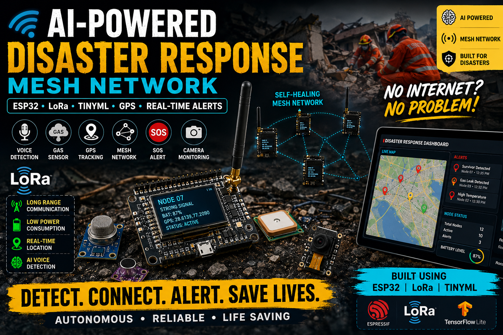

# 🚨 AI-Powered Disaster Response Mesh Network




---

## 📖 Overview

The **AI-Powered Disaster Response Mesh Network** is an intelligent emergency communication and survivor detection system built using **ESP32-S3**, **LoRa**, **TinyML**, and environmental sensors.

The platform is designed to operate during:

- Earthquakes
- Floods
- Building Collapses
- Landslides
- Wildfires
- Search & Rescue Operations

When traditional communication infrastructure becomes unavailable, the network automatically forms a decentralized LoRa mesh capable of transmitting emergency information, environmental telemetry, and survivor alerts.

---

## 🎯 Features

### 📡 Communication

- Long-range LoRa communication
- Self-healing mesh network
- Multi-hop routing
- Emergency packet broadcasting
- Internet-independent operation

### 🤖 TinyML Survivor Detection

- Human voice detection
- Cry-for-help recognition
- Audio classification
- Edge AI inference
- Confidence scoring

### 🌍 GPS Tracking

- Real-time location reporting
- Rescue node tracking
- Survivor coordinates transmission

### 🌡 Environmental Monitoring

- Temperature monitoring
- Humidity monitoring
- Air pressure monitoring
- Gas leak detection
- Structural vibration detection

### 🚨 Emergency Services

- SOS emergency button
- Survivor alerts
- Critical emergency broadcasts
- Local siren activation
- Event logging

### 📺 OLED Dashboard

- GPS status
- LoRa status
- Battery level
- Environmental telemetry
- Alert visualization

---

# 🏗 System Architecture

```text
                ┌─────────────────────┐
                │   Command Center    │
                │ MQTT + Dashboard    │
                └──────────┬──────────┘
                           │
                      LoRa Gateway
                           │
        ┌──────────────────┼──────────────────┐
        │                  │                  │
        ▼                  ▼                  ▼

   Rescue Node       Rescue Node        Camera Node
    ESP32-S3          ESP32-S3          ESP32-CAM

        │                 │                 │

   GPS Sensors      AI Detection      Visual Feed
```

---

# 🔧 Hardware Components

## Core Controller

- ESP32-S3 Development Board

## Communication

- SX1278 LoRa Module

## Sensors

- NEO-6M GPS Module
- BME280 Environmental Sensor
- MQ-2 Gas Sensor
- SW-420 Vibration Sensor
- INMP441 Microphone

## User Interface

- SSD1306 OLED Display
- Buzzer
- SOS Push Button
- Status LEDs

## Power

- Li-Ion Battery
- Solar Panel (Optional)

---

# 📂 Project Structure

```text
firmware/
│
├── platformio.ini
│
├── include/
│   ├── config.h
│   ├── pins.h
│   ├── packet.h
│   ├── node_types.h
│   └── system_state.h
│
├── src/
│   ├── main.cpp
│   │
│   ├── communication/
│   │   ├── lora_mesh.cpp
│   │   ├── lora_mesh.h
│   │   ├── packet_encoder.cpp
│   │   ├── packet_encoder.h
│   │   ├── routing.cpp
│   │   └── routing.h
│   │
│   ├── sensors/
│   │   ├── gps.cpp
│   │   ├── gps.h
│   │   ├── gas_sensor.cpp
│   │   ├── gas_sensor.h
│   │   ├── bme280.cpp
│   │   ├── bme280.h
│   │   ├── vibration.cpp
│   │   ├── vibration.h
│   │   ├── microphone.cpp
│   │   └── microphone.h
│   │
│   ├── ai/
│   │   ├── tinyml_inference.cpp
│   │   ├── tinyml_inference.h
│   │   ├── feature_extraction.cpp
│   │   ├── feature_extraction.h
│   │   └── model_data.h
│   │
│   ├── emergency/
│   │   ├── sos_manager.cpp
│   │   ├── sos_manager.h
│   │   ├── alarm_manager.cpp
│   │   └── alarm_manager.h
│   │
│   ├── display/
│   │   ├── oled_display.cpp
│   │   └── oled_display.h
│   │
│   ├── power/
│   │   ├── battery.cpp
│   │   ├── battery.h
│   │   ├── solar_manager.cpp
│   │   └── solar_manager.h
│   │
│   ├── tasks/
│   │   ├── sensor_task.cpp
│   │   ├── lora_task.cpp
│   │   ├── ai_task.cpp
│   │   ├── gps_task.cpp
│   │   ├── display_task.cpp
│   │   └── emergency_task.cpp
│   │
│   └── dashboard/
│       ├── mqtt_client.cpp
│       ├── mqtt_client.h
│       ├── wifi_manager.cpp
│       └── wifi_manager.h
│
└── LICENSE
```

---

# 🚀 Getting Started

## Clone Repository

```bash
git clone https://github.com/yourusername/ai-disaster-response-mesh-network.git
cd ai-disaster-response-mesh-network
```

## Install PlatformIO

```bash
pip install platformio
```

## Build Firmware

```bash
pio run
```

## Upload Firmware

```bash
pio run --target upload
```

## Open Serial Monitor

```bash
pio device monitor
```

---

# 📡 LoRa Configuration

```cpp
#define LORA_FREQUENCY 433E6

LoRa.setSpreadingFactor(12);
LoRa.setSignalBandwidth(125E3);
LoRa.setCodingRate4(5);
```

---

# 🤖 TinyML Pipeline

```text
Microphone
     │
     ▼
Audio Buffer
     │
     ▼
Feature Extraction
     │
     ▼
TinyML Model
     │
     ▼
Classification

Noise
Voice
Cry For Help
Survivor Detected
```

---

# 📊 Telemetry Data

```json
{
  "node": 1,
  "temperature": 28.4,
  "humidity": 62.3,
  "gas": 120,
  "battery": 4.05,
  "latitude": 28.6139,
  "longitude": 77.209,
  "survivor": true,
  "confidence": 94
}
```

---

# 🔐 Future Enhancements

- AES-128 Encryption
- OTA Updates
- ESP32-CAM Integration
- Thermal Camera Support
- Drone-Based Relay Nodes
- Satellite Communication
- Edge AI Optimization
- Autonomous Rescue Robots

---

# 🧪 Testing Scenario

1. Deploy multiple rescue nodes.
2. Establish LoRa mesh network.
3. Simulate network outage.
4. Generate SOS event.
5. Detect voice using TinyML.
6. Transmit alert packet.
7. Display alert on dashboard.
8. Coordinate rescue operations.

---

# 📈 Applications

- Disaster Response
- Search and Rescue
- Military Communications
- Smart Cities
- Industrial Safety
- Environmental Monitoring
- Emergency Preparedness

---

# 🤝 Contributing

Contributions are welcome.

1. Fork the repository
2. Create a feature branch
3. Commit changes
4. Push branch
5. Open Pull Request

---

# 📄 License

This project is licensed under the MIT License.

See the LICENSE file for details.

---

# 👨‍💻 Author

**Shivam Singh**

Computer Science Engineer  
Embedded Systems | Aerospace Systems | Flight Controllers | AI & Robotics

---

## ⭐ Support

If you found this project useful, please consider giving it a star ⭐ on GitHub.
